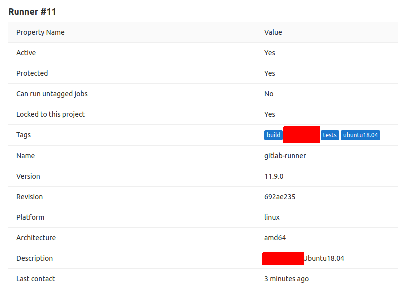

# Gitlab CI/CD Example for Python-based Apps

![pipeline status][1] ![coverage report][2]

## CONTENTS

* [DEPENDENCIES](#dependencies)
* [SETUP](#setup)
* [USAGE](#usage)
* [ISSUES](#issues)
* [DOCUMENTATION](#documentation)

## DEPENDENCIES

* The main requirements are:
    * [pytest](https://docs.pytest.org/en/latest/contents.html) for running unit tests
    * [pytest-cov](https://github.com/pytest-dev/pytest-cov) for checking code coverage
    * Access to a Gitlab instance
    * Access to a build/test/server PC for `gitlab-runner`
* For other example-specific dependencies, see [requirements.txt](./requirements.txt).

## SETUP

* Setting-Up the Tests
    * Activate a virtual environment
    * Install dependencies
        ```
        pip3 install -r requirements.txt

        ```
    * Configure app installation in [setup.py](./setup.py)
    * Configure test setup in [pytest.ini](./pytest.ini)
* Setting-Up Gitlab CI
    * [Install a Gitlab Runner](https://docs.gitlab.com/runner/install/) on a publicly-accessible machine
    * [Register the Runner](https://docs.gitlab.com/runner/register/index.html) with your Gitlab instance
        * Get the coordinator URL and registration tokens:
            * For shared runners: <http://your/gitlab/instance/admin/runners>
            * For project-specific runners: <http://your/gitlab/project/settings/ci_cd>
        * Use [Docker as the executor](https://docs.gitlab.com/runner/executors/docker.html)
        * Set project-specific [tags](https://docs.gitlab.com/ee/ci/runners/#using-tags)
    * Configure the CI configuration in [.gitlab-ci.yml](./gitlab-ci.yml)
        * Set which Docker [image](https://docs.gitlab.com/runner/executors/docker.html#the-image-keyword) and [services](https://docs.gitlab.com/runner/executors/docker.html#the-services-keyword) to use
        * Set the [tags](https://docs.gitlab.com/ee/ci/runners/#using-tags)
        * Set the commands for `before_script` and `script`
        * For other configurations, see [GitLab CI/CD Pipeline Configuration Reference](https://docs.gitlab.com/ee/ci/yaml/)
    * Configure the Gitlab Runner at *Gitlab project* > *Settings* > *CI/CD*
        * Select *Disable AutoDevOps* to explicitly require *.gitlab-ci.yml*
        * Enable the runner only for "important" commits
            * Enable only on tagged jobs
            * Enable only on protected branches (ex. `develop`, `master`)
        * Set other options such as *Timeout*, *Custom CI config path*, and *Triggers*
        * Sample Configuration:
            

## USAGE

* Manually Running the Tests on Local
    * Activate a virtual environment
    * Install app in virtual env in [editable mode](https://pip.pypa.io/en/stable/reference/pip_install/#editable-installs)
        ```
        pip3 install -e .

        ```
    * Run the tests
        ```
        pytest tests

        ```
* Triggering the CI Pipeline
    * Make changes to the app and to the tests
    * Update the [.gitlab-ci.yml](./gitlab-ci.yml) file (if necessary)
    * Commit and push
    * Go to the *Gitlab project* > *CI/CD* > *Pipelines* and/or *Jobs*
    * It is possible to download the job log by clicking on the *Raw* button

## ISSUES

* `pytest` uses cached codes instead of latest
    * Clear the `pytest` cache with [--cache-clear](https://docs.pytest.org/en/latest/cache.html#clearing-cache-content)
    * Optionally, also [clear the generated *\_\_pycache\_\_*](https://stackoverflow.com/q/28991015/2745495)
* "*This job is stuck, because you don’t have any active runners that can run this job.*"
    * Make sure that the *.gitlab-ci.yml* has the correct tags
    * Make sure the `gitlab-runner` service is running
    * Make sure the machine running `gitlab-runner` is accessible by the Gitlab instance
* "*yaml invalid*"
    * Go to the *Gitlab project* > *CI/CD*
    * On the top-right portion, click the *CI Lint* button
    * Paste the contents of *gitlab-ci.yml* file and validate
* The jobs are not running on the same runner/environment
    * Example: 1 job for build, 1 job for tests
    * As of now, Gitlab CI does not support this:
        * [Sticky Runners](https://gitlab.com/gitlab-org/gitlab-ce/issues/29447)
        * [Caching general build artifacts between stages](https://gitlab.com/gitlab-org/gitlab-runner/issues/336)
        * [Force all pipeline jobs to execute on same concurrent runner](https://gitlab.com/gitlab-org/gitlab-ce/issues/30060)
    * The current workaround now is to use `before_script` to build and a job for tests

## DOCUMENTATION

* On Setting-Up the Tests
    * [pytest](https://pytest.readthedocs.io/en/latest/contents.html)
        * [Invoking `pytest`](https://docs.pytest.org/en/latest/usage.html)
        * [Good Integration Practices](https://pytest.readthedocs.io/en/latest/goodpractices.html)
    * Using *src*/*tests* layout
        * [How to Setup Files/Folders](https://docs.pytest.org/en/latest/goodpractices.html#tests-outside-application-code)
        * [How to Add *src* to *sys.path*](https://docs.python.org/3.5/distutils/setupscript.html#listing-whole-packages)
        * [How to Add *src/\** packages](https://setuptools.readthedocs.io/en/latest/setuptools.html#find-namespace-packages)
    * Configuring `pytest`
        * [pytest.ini](https://docs.pytest.org/en/latest/reference.html#configuration-options)
* On Setting-Up Gitlab CI
    * [Getting started with GitLab CI](http://192.168.1.61/help/ci/quick_start/README)
    * [Installing a Gitlab Runner](https://docs.gitlab.com/runner/install/)
    * [Registering a Gitlab Runner](https://docs.gitlab.com/runner/register/index.html)
    * [Configuring a Gitlab Runner](https://docs.gitlab.com/runner/#configuring-gitlab-runner)
    * [.gitlab-ci.yml Reference](https://docs.gitlab.com/ee/ci/yaml/README.html)

[1]: http://192.168.1.61/commonpf/sample-ci-python/badges/master/pipeline.svg
[2]: http://192.168.1.61/commonpf/sample-ci-python/badges/master/coverage.svg
